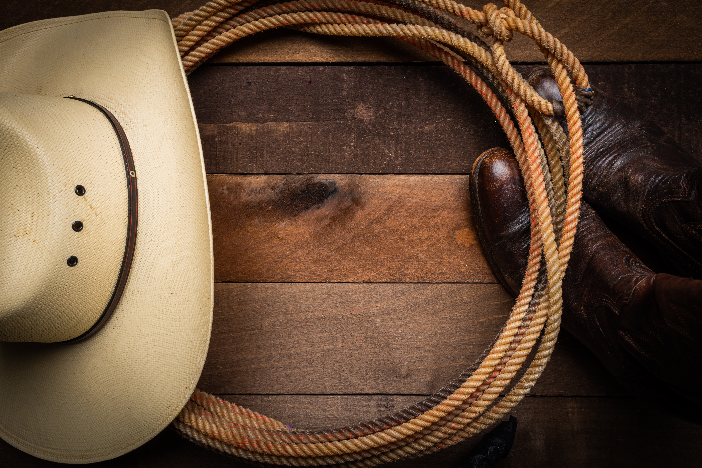

## What are the acoustic and racial dimensions of "country talk"?
::: {.grid}
::: {.g-col-12 .g-col-md-2}

:::
::: {.g-col-12 .g-col-md-10}
Description coming soon!
:::
:::

## How do bisexual stoner women construct their identity through language?
::: {.grid}
::: {.g-col-12 .g-col-md-2}

:::
::: {.g-col-12 .g-col-md-10}
Description coming soon!
:::
:::